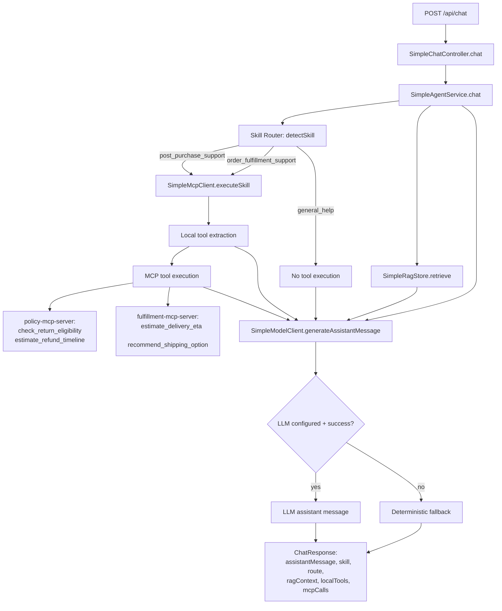

# Code Flow And Exploration Guide

This document explains the current production-style setup:

- 2 skills (`post_purchase_support`, `order_fulfillment_support`)
- 2 local tools (`extract_return_context`, `extract_delivery_context`)
- 2 MCP servers with 2 tools each

Use this as the fastest way to explore where behavior lives.

## End-to-End Flowchart

## Explore In This Order

1. API entrypoint  
   - `backend/src/main/java/com/example/clothesstoreagent/simple/SimpleChatController.java`
2. Routing and orchestration  
   - `backend/src/main/java/com/example/clothesstoreagent/simple/SimpleAgentService.java`
3. Local tools + MCP call simulation  
   - `backend/src/main/java/com/example/clothesstoreagent/simple/SimpleMcpClient.java`
4. Context retrieval (RAG)  
   - `backend/src/main/java/com/example/clothesstoreagent/simple/SimpleRagStore.java`
5. LLM prompt and fallback boundary  
   - `backend/src/main/java/com/example/clothesstoreagent/simple/SimpleModelClient.java`
6. Frontend metadata rendering  
   - `frontend/src/App.js`
7. MCP server scripts (tool contracts)  
   - `mcp-servers/policy/server.js` (policy server behavior)
   - `mcp-servers/fulfillment/server.js`
8. Tests that lock behavior  
   - `backend/src/test/java/com/example/clothesstoreagent/simple/SimpleAgentServiceTest.java`
   - `backend/src/test/java/com/example/clothesstoreagent/simple/SimpleMcpClientTest.java`

## Skill And Tool Matrix

| Skill | Local Tool | MCP Server | MCP Tools |
|---|---|---|---|
| `post_purchase_support` | `extract_return_context` | `policy-mcp-server` | `check_return_eligibility`, `estimate_refund_timeline` |
| `order_fulfillment_support` | `extract_delivery_context` | `fulfillment-mcp-server` | `estimate_delivery_eta`, `recommend_shipping_option` |

## UI Message Examples (All Cases Covered)

Type these directly in the UI chat box.

| Case | Message To Send From UI | Skill | Local Tool | Route | Expected Outcome |
|---|---|---|---|---|---|
| Return eligibility (success) | `I got this 12 days ago, it is unused and has tags. Can I return it?` | `post_purchase_support` | `extract_return_context` | `policy-mcp-server/check_return_eligibility` | `eligible=true` style response |
| Return eligibility (validation failure) | `Can I return this jacket? It is unused and has tags.` | `post_purchase_support` | `extract_return_context` | `policy-mcp-server/check_return_eligibility` | `ok=false`, `errorCode=VALIDATION_ERROR`, asks for days since delivery |
| Refund timeline | `How long will my refund take after return?` | `post_purchase_support` | `extract_return_context` | `policy-mcp-server/estimate_refund_timeline` | timeline estimate response |
| Delivery ETA | `How fast can this ship internationally with express delivery?` | `order_fulfillment_support` | `extract_delivery_context` | `fulfillment-mcp-server/estimate_delivery_eta` | ETA range (for example `3-6` business days) |
| Shipping recommendation | `Which shipping option should I use if I need it in 2 days?` | `order_fulfillment_support` | `extract_delivery_context` | `fulfillment-mcp-server/recommend_shipping_option` | recommendation (usually `express` for urgent need) |
| General help (no tools) | `Hello, what can you help me with?` | `general_help` | none | `none` | no local/MCP tool calls; general assistant guidance |

## Flow Explanation For Each Example

### 1) Return eligibility (success)

1. UI sends message to `POST /api/chat`.
2. `SimpleAgentService.detectSkill` routes to `post_purchase_support`.
3. `extract_return_context` parses days/condition/tags from text.
4. MCP call runs `policy-mcp-server/check_return_eligibility`.
5. Response includes `skill`, `route`, `localTools`, and `mcpCalls` with success output.

### 2) Return eligibility (validation failure)

1. UI sends message to `POST /api/chat`.
2. Router still selects `post_purchase_support`.
3. `extract_return_context` cannot find required `days since delivery`.
4. MCP tool `check_return_eligibility` returns `ok=false` with `VALIDATION_ERROR`.
5. Assistant response asks for missing detail so the flow can be retried.

### 3) Refund timeline

1. UI sends message to `POST /api/chat`.
2. Router selects `post_purchase_support`.
3. Local return extractor runs first.
4. MCP call runs `policy-mcp-server/estimate_refund_timeline`.
5. Response includes timeline output in `mcpCalls[0].output`.

### 4) Delivery ETA

1. UI sends message to `POST /api/chat`.
2. Router selects `order_fulfillment_support`.
3. `extract_delivery_context` parses region/speed/urgency/budget.
4. MCP call runs `fulfillment-mcp-server/estimate_delivery_eta`.
5. Response returns ETA range plus route metadata.

### 5) Shipping recommendation

1. UI sends message to `POST /api/chat`.
2. Router selects `order_fulfillment_support`.
3. Delivery extractor runs.
4. MCP call runs `fulfillment-mcp-server/recommend_shipping_option`.
5. Response includes recommendation and rationale in `mcpCalls`.

### 6) General help (no tools)

1. UI sends message to `POST /api/chat`.
2. Router selects `general_help`.
3. No local tool and no MCP call are executed.
4. Assistant returns general guidance and any relevant RAG context if found.
5. Response shows `route=none`, empty `localTools`, and empty `mcpCalls`.

## If You Want To Change Behavior

- Add a new skill route: edit `SKILL_RULES` in `SimpleAgentService.java`
- Add local extraction logic: edit `SimpleMcpClient.java` extraction methods
- Add a new MCP tool branch: edit `SimpleMcpClient.java` tool selection + result mapping
- Add server-side tool contract: edit corresponding file in `mcp-servers/`
- Keep response contract docs in sync: update `API_BEHAVIOR.md`
- Add/adjust verification: update tests in `backend/src/test/java/...`

